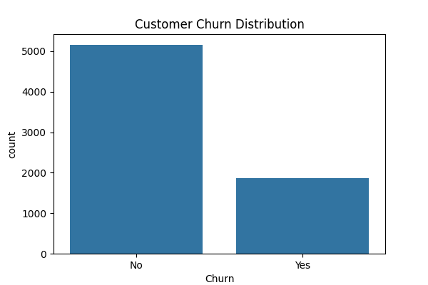
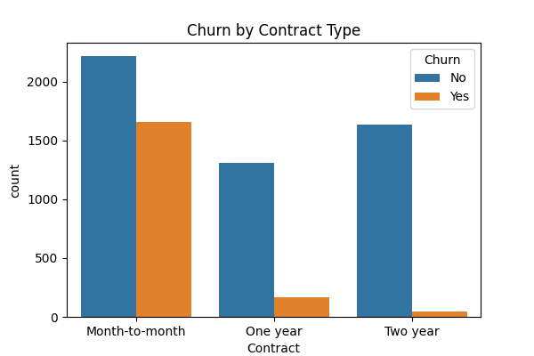
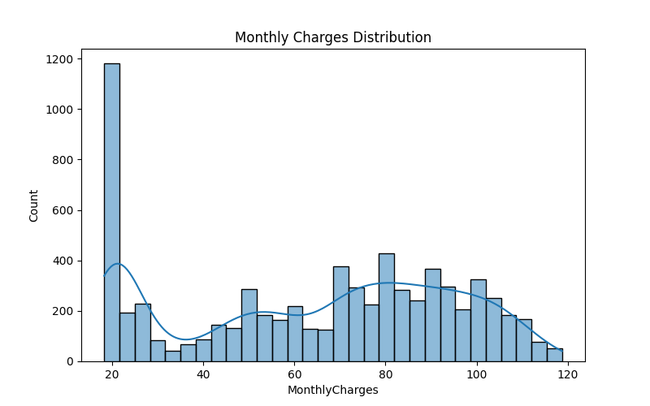

# 📊 Customer Churn Prediction Project

This project analyzes customer data from a telecom company and predicts whether a customer will churn using machine learning techniques.

## 📈 What’s Inside?

📊 Churn Distribution: Number of customers who stayed vs left
📉 Churn by Contract Type
📊 Monthly Charges Distribution

🤖 Machine Learning Model: Logistic Regression

## 📦 Dataset

Telco Customer Churn Dataset

## 🔧 Tools & Libraries Used

* Python
* Pandas
* Matplotlib
* Seaborn
* Scikit-learn

## 📸 Outputs





## 🚀 Model Performance

Accuracy: ~75%–85%

## 🚀 How to Run

1. Install required libraries:

```
pip install pandas matplotlib seaborn scikit-learn
```

2. Run the project:

```
python churn_prediction.py
```

## 🧠 Project Workflow

* Data Cleaning and preprocessing
* Exploratory Data Analysis (EDA)
* Feature encoding using One-Hot Encoding
* Model training using Logistic Regression
* Model evaluation using accuracy and classification report

## 🙌 Contributions

Open to suggestions or improvements — feel free to fork and submit pull requests.
